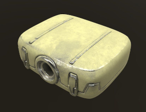

# Cartridge



Run methods in another process, and `Drop` it when you don't need it.

```Rust
use cartridge::cartridge;

struct MyStruct;

#[cartridge(MyStructHandler)]
impl MyStruct {
    /// TODO
    fn new() -> Self {
        // ...
    }
}
```

## License

This is free and unencumbered software released into the public domain.

Anyone is free to copy, modify, publish, use, compile, sell, or distribute this software, either in source code form or as a compiled binary, for any purpose, commercial or non-commercial, and by any means.
